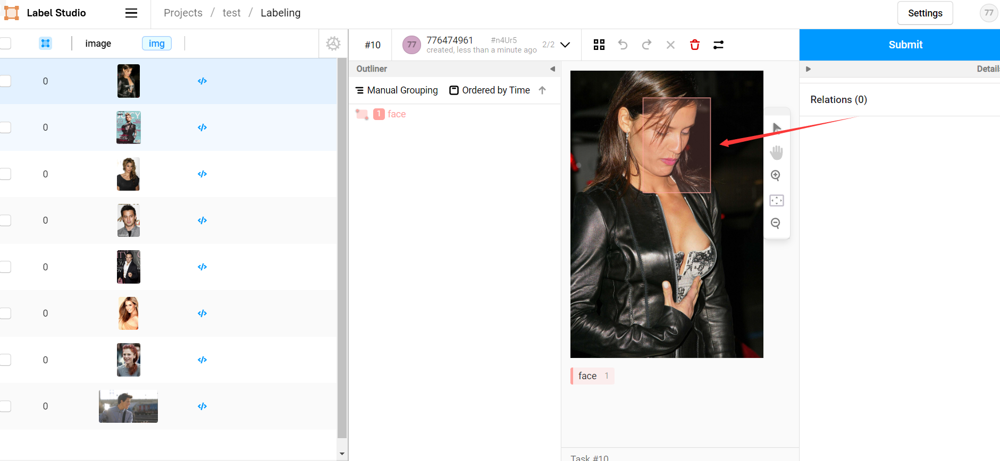
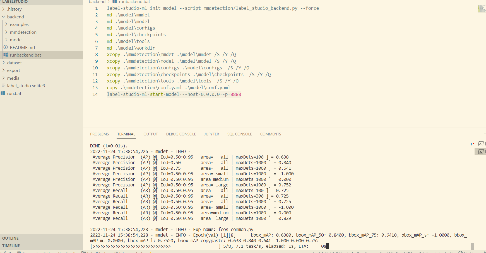

## label-studio-demo
结合 mmdetection 、 label studio 实现数据集自动标注、模型自动迭代的 AI 闭环。

## 依赖

软件    |    版本
:-: |   :-:
python   |   3.9.12
label-studio   |   1.6.0
label-studio-ml   |   1.0.8
label-studio-tools   |   0.0.1
torch   |   1.11.0+cu113
torchaudio   |   0.11.0+cu113
torchvision   |   0.12.0+cu113
mmcv-full   |   1.5.1
mmdet   |   2.24.1

## 目录结构
```bash
LabelStudio
├── backend         // 后端功能
│   ├── examples    // label studio ml 官方示例（非必须）
│   ├── mmdetection // mmdetection 人脸检测模型
│   ├── model       // label studio ml 生成的后端服务 （自动生成）
│   ├── workdir     // 模型训练时工作目录
│   |   ├── fcos_common_base.pth    // 后端模型基础权重文件
│   |   └── latest.pth              // 后端模型最新权重文件
│   └── runbackend.bat  // 生成并启动后端服务的脚本文件
├── dataset         // 实验所用数据集（非必须）      
├── label_studio.sqlite3    // label studio 数据库文件
├── media      
│   ├── export
│   └── upload  // 上传的待标记数据集
└── run.bat     // 启动 label studio 的脚本文件（非必须）
```

## 启动
### 启动前端服务
在根目录下执行：
```bash
label-studio --data-dir . -p 80
```
### 启动后端服务
1. 修改配置文件  
修改 `backend/mmdetection/conf.yaml` 和  `backend/model/conf.yaml` 文件中路径为你自己的路径：  
```yaml
config_file: D:\CommonProject\LabelStudio\backend\mmdetection\model\fcos_common.py
checkpoint_file: D:\CommonProject\LabelStudio\backend\workdir\latest.pth
device: cuda:0
workdir: D:\CommonProject\LabelStudio\backend\workdir
```
2. 添加预标记模型权重  
把与 `label_studio_backend.py` 中模型匹配的权重文件复制到 backend/workdir/latest.pth 中。
1. 启动后端服务  
在 backend 目录下执行：
```bash
label-studio-ml start model --host 0.0.0.0 -p 8888
```

## 相关教程
- [MMDetection 详解：从入门到出门](https://ifantasy.net/2022/05/20/mmdetection_setup_and_train_custom_data)
- [label studio 结合 MMDetection 实现数据集自动标记、模型迭代训练的闭环](https://ifantasy.net/2022/07/27/label_studio_setup_and_auto_label)

## 结果展示

